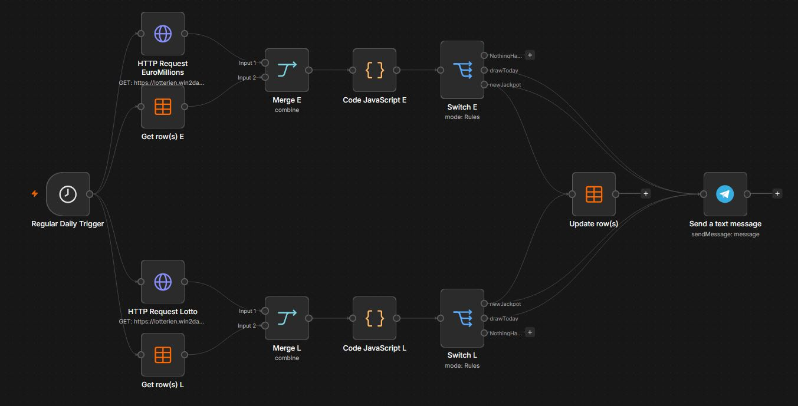

# Austrian Lottery Jackpot Notifications

An n8n workflow that monitors Austrian Lotto and EuroMillions jackpots and sends automated Telegram notifications on draw days and when new jackpots are announced.



## Features

- Checks Lotto 6 aus 45 and EuroMillions once per day
- Sends a Telegram reminder when a draw takes place that day
- Sends the new jackpot amount after the draw information changes
- Stores the latest draw date in an n8n Data Table to prevent duplicate jackpot notifications

## How it works

The workflow runs daily at 07:00. For each lottery game, it retrieves the current draw information and compares the returned draw date with the date stored in an n8n Data Table.

Depending on the result, the workflow performs one of three actions:

| Event | Action |
| --- | --- |
| The next draw is today | Send a draw-day reminder with the current jackpot |
| The draw date differs from the stored date | Send the newly announced jackpot and update the stored date |
| Nothing has changed | Do not send a message |

The workflow obtains draw information from the public endpoints used by the Austrian Lotteries website:

- `https://lotterien.win2day.at/jam/drawgame/v1/drawInfo/EUROMILLIONEN`
- `https://lotterien.win2day.at/jam/drawgame/v1/drawInfo/LOTTO`

## Requirements

- An n8n instance with access to the Data Table node
- A Telegram bot
- An n8n Telegram credential containing the bot token
- A Telegram chat ID

## Setup

### 1. Import the workflow

Download `n8n_workflow_jackpot_message.json` and import it into n8n using **Import from File**.

The imported workflow is disabled by default so that it cannot run before configuration is complete.

### 2. Create the Data Table

Create an n8n Data Table with the following columns:

| Column | Type | Description |
| --- | --- | --- |
| `game` | String | Lottery identifier |
| `saved_date` | String | Last processed draw date in `YYYY-MM-DD` format |

Add these two rows:

| `game` | `saved_date` |
| --- | --- |
| `EUROMILLIONEN` | A valid initial draw date |
| `LOTTO` | A valid initial draw date |

Replace `YOUR_DATA_TABLE_ID` in all three Data Table nodes with the ID of the table you created:

- `Get row(s) E`
- `Get row(s) L`
- `Update row(s)`

### 3. Configure Telegram

Create or select your Telegram credential in the `Send a text message` node. The public workflow file does not contain a bot token or credential reference.

The chat ID is read from the following environment variable:

```text
TELEGRAM_CHAT_ID
```

Add this variable to your n8n environment and restart n8n if required. If environment-variable access is disabled in your n8n installation, replace the expression in the Telegram node with your chat ID directly. Do not commit the resulting private workflow export to a public repository.

### 4. Test and activate

Run the workflow manually and check the output of both branches. Once the Data Table and Telegram nodes work correctly, activate the workflow.

## Telegram messages

On a draw day, the workflow sends a message similar to:

```text
🎰 Lotto 6 aus 45

Heute ist Ziehung!
Jackpot: 5.5 Mio. €
```

When a new jackpot is available, it sends:

```text
🎰 EuroMillionen

Neuer Jackpot: 89 Mio. €
Nächste Ziehung: 2026-09-18
```

## Security

The repository version does not include:

- Telegram bot tokens
- Telegram chat IDs
- n8n credential references
- n8n instance, project, workflow or Data Table IDs
- execution or pinned test data

Never commit credentials, `.env` files or private n8n exports to the repository.

## Limitations

- The workflow depends on external endpoints that may change without notice.
- Jackpot values and draw dates are provided by the external data source.
- Notifications require the n8n instance to be online when the scheduled execution starts.

## Disclaimer

This is an independent personal project and is not affiliated with, endorsed by or operated by win2day or Österreichische Lotterien. It does not provide gambling advice and does not purchase lottery tickets.
